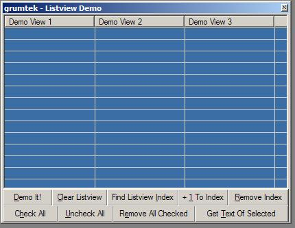



## Listview Demo

### Description

This is a really good demo that will help show you all the basics with using a listview and how it works compaired to a listbox. I added as much comments as I could and I think it will really help you to get started with using a Listview.
 
### More Info
 

             |
---                |---
**Submitted On**   |2004-08-24 13:01:28
**By**             |[grumtek](https://github.com/Planet-Source-Code/PSCIndex/blob/master/ByAuthor/grumtek.md)
**Level**          |Intermediate
**User Rating**    |4.7 (14 globes from 3 users)
**Compatibility**  |VB 5\.0, VB 6\.0
**Category**       |[Miscellaneous](https://github.com/Planet-Source-Code/PSCIndex/blob/master/ByCategory/miscellaneous__1-1.md)
**World**          |[Visual Basic](https://github.com/Planet-Source-Code/PSCIndex/blob/master/ByWorld/visual-basic.md)
**Archive File**   |[Listview\_D1785428242004\.zip](https://github.com/Planet-Source-Code/grumtek-listview-demo__1-55795/archive/master.zip)

